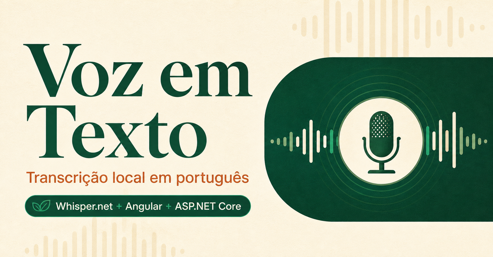

# Voz em Texto — MVP com Whisper.net



MVP web para gravar até 15 segundos de áudio pelo microfone, transcrever a fala
em português no próprio servidor e manter as dez transcrições mais recentes.

Não utiliza API paga nem envia o áudio para serviços de terceiros. O arquivo de
áudio é temporário e apagado depois do processamento; somente o texto e algumas
métricas são persistidos no SQLite.

## Stack

- Angular 22
- ASP.NET Core 10
- Whisper.net 1.9 com o modelo multilíngue `base`
- Entity Framework Core + SQLite
- FFmpeg para normalizar WebM, MP4, OGG, MP3 ou WAV
- Docker para executar tudo em um único serviço

## Rodar com Docker

Requer Docker com Compose. Na raiz do repositório:

```bash
docker compose up --build
```

Acesse [http://localhost:8080](http://localhost:8080).

No primeiro áudio, o servidor baixa aproximadamente 142 MB do modelo
`ggml-base.bin`. Os próximos envios reutilizam o modelo salvo no volume Docker.
O banco também fica em um volume e sobrevive à recriação do container.

## Rodar para desenvolvimento

Requisitos:

- .NET SDK 10
- Node.js 24 e npm
- FFmpeg e FFprobe disponíveis no `PATH`

Terminal da API:

```bash
dotnet run --project api
```

Terminal do Angular:

```bash
cd web
npm install
npm start
```

Acesse [http://localhost:4200](http://localhost:4200). O Angular encaminha as
requisições `/api` para a API em `http://localhost:5010`.

## Produção e celular

O navegador só permite acesso ao microfone em `localhost` ou em uma origem
HTTPS. Para testar pelo celular, publique o container atrás de um domínio com
TLS, por exemplo usando Caddy, Nginx, Traefik ou o proxy do seu provedor.

Recomendação para o host:

- Linux x64 ou ARM64 com Docker
- mínimo de 1 GB de RAM; 2 GB são mais confortáveis
- disco persistente para `/app/storage` e `/app/models`
- uma única réplica, pois o MVP utiliza um arquivo SQLite

## API

### Enviar áudio

```http
POST /api/transcriptions
Content-Type: multipart/form-data
```

Campo do arquivo: `audio`. Limites: 15 segundos e 2 MB.

### Listar histórico

```http
GET /api/transcriptions
```

Retorna as dez transcrições mais recentes.

### Saúde

```http
GET /api/health
```

## Estrutura

```text
api/        ASP.NET Core, SQLite, FFmpeg e Whisper.net
api.tests/  testes de integração da API
web/        aplicação Angular responsiva
Dockerfile  build conjunto do frontend e backend
```

## Validação

```bash
dotnet test VoiceMvp.slnx -c Release
cd web
npm test -- --watch=false
npm run build
```

## Observações

- O idioma do Whisper é fixado como português (`pt`).
- O modelo é carregado uma vez e as transcrições são serializadas para evitar
  estouro de CPU e memória em hosts pequenos.
- O repositório não contém o modelo nem áudios gravados.
- Para múltiplas instâncias ou uso em produção, substitua o SQLite por um banco
  servidor e adicione autenticação.

## Licença

[MIT](LICENSE)
